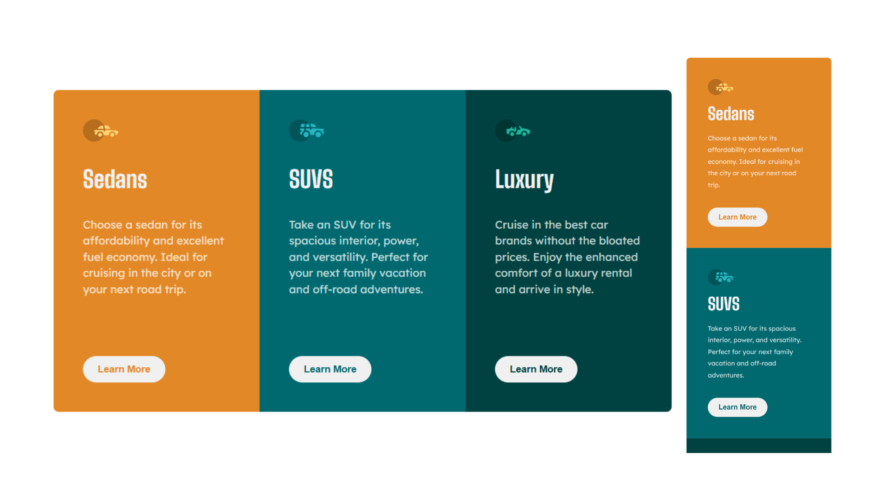

## Overview
I built a responsive three-column preview card component using semantic HTML and Flexbox. This project helped reinforce responsive layouts, reusable styling with CSS variables, and component-based organization.

### Key learnings
- Built a responsive layout using Flexbox.
- Used CSS variables for consistent colors and typography.
- Improved my understanding of :nth-child() and descendant selectors.
- Learned how Flexbox stretching affects element sizing and how align-self overrides it.
- Practiced organizing HTML and CSS using the BEM naming convention.
- Gained more confidence debugging layout and selector issues.

## Project
- Live Site URL: https://daxitaseervi.github.io/3-column-preview-card/

## Links
- Twitter/X: [https://x.com/kazzyyy__](https://x.com/kazzyyy__)
- Codepen: [https://codepen.io/Daxita-Seervi](https://codepen.io/Daxita-Seervi)
- Frontend Mentor: [https://www.frontendmentor.io/profile/daxitaseervi](https://www.frontendmentor.io/profile/daxitaseervi)
